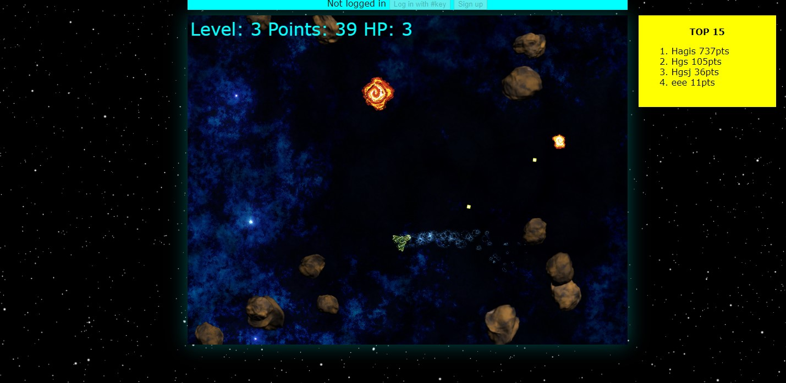

# SPACE SMASHER 9001!

Tested on node `v14.17.3`

You can play the game [here](https://mystifying-hypatia-4b1cef.netlify.app/) (unfortunelly I can not setup server, so this instance does not provide a ranking 😥).
Please be patient waiting for the game to load. My crappy, free hosting need some time to load assets.

The game was created for the first edition of [Hackerspace Trójmiasto's Community](https://github.com/hs3city/hs3-jam) Jam.



## How to start a game

You need the [NodeJS](https://nodejs.org/en/) installed.

~~The game's server do not serve game client's files. They are separately apps.~~
The server is responsible for authentication and storing records.
Data is stored as plain JSON files in `server/storage` directory.
You do not have to setup any external database :)

The game *should* work without server, with some limitations.
Space Smasher works fine on desktop, and not on mobile at all.

Keys: `WSAD + Mouse`

## Use Docker

### LETS GO
```sh
# run as a daemon
🐧 docker run -d  -p 80:80 --restart=always --name smasher ghcr.io/kgrzeg/space-smasher-9001:latest
# or run in foreground
🐧 docker run -ti -p 80:80 --rm --name smasher ghcr.io/kgrzeg/space-smasher-9001:latest
```

### Build image locally
```sh
🐧 docker build -t space-smasher-9001:latest .
# run as a daemon
🐧 docker run -d  -p 80:80 --restart=always --name smasher space-smasher-9001
# or run in foreground
🐧 docker run -ti -p 80:80 --rm --name smasher space-smasher-9001
```

## Setup for development
### run server
```sh
🐧 cd server
🐧 npm install # install dependencies
🐧 cp .env.example .env
🐧 # edit .env file - UPDATE THE SECRET!
🐧 npm start # the server listening on port 3000. 
```

### Setup and run client
```sh
🐧 cd .. # only if your cwd is server directory
🐧 cd game
🐧 npm install # install dependencies
🐧 # edit first line of src/api.ts to match your server
🐧 npm start # to run in Dev mode (hot reloading and recompilling)
🐧 npm run build
🐧 # your app is in dist directory, you need to serve it via www server
```

The most knowledge you can get by reading the sources or dockerfile. I will fill the readme one day... maybe.

## Enjoy!
